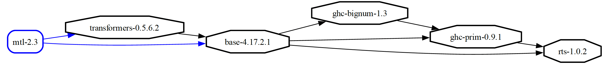

# Comprendre les dépendances d'un projet Haskell


J'ai trouvé une librairie qui permet d'afficher l'arbre de dépendance des librairies utilisée dans un projet Haskell. Pour cela, installons la librairie Cabal-plan : https://hackage.haskell.org/package/cabal-plan (`cabal install cabal-plan`).


Pour comprendre l'intérêt de Cabal-plan, prenons une librairie avec peu de dépendance comme https://hackage.haskell.org/package/mtl. Installons la librairie quelque part sur un ordi : `git clone  https://github.com/haskell/mtl.git`. Puis une compilation directe avec `cabal build`.

La commande qui permet de voir l'arbre de dépendance dans ton terminal est `cabal-plan tred`. On obtient l'affichage suivant, c'est à dire l'ensemble des librairies utilisées directement par mtl ainsi que les numéros de versions et toutes les dépendances à chaque librairie utilisée :

```
mtl-2.3.1
 └─ transformers-0.5.6.2
     └─ base-4.17.2.1
         └─ ghc-bignum-1.3
             └─ ghc-prim-0.9.1
                 └─ rts-1.0.2
```

Je trouve cette fonctionnalité très utile pour vérifier qu'une  librairie avec un numéro de version précis est bien utilisé dans le projet que je suis en train de travailler. Concrêtement, j'ai du modifier la librairie [soap-tls](https://hackage.haskell.org/package/soap-tls) dont la version actuelle utilise tls-1.6.0. Je souhaitais que soap-tls utilise la version tls-2.1.0. Cabal-plan m'a permis de vérifier le numéro de version de tls et publier un [patch](https://bitbucket.org/dpwiz/haskell-soap/pull-requests/7). 


## Comparer deux versions

La comparaison de deux versions est très agréable pour voir les différences à tous les niveaux. J'ai installé un deuxième projet mtl en ciblant une version git correspondant à la version 2.3 plus ancienne. 

La commande `diff 
cabal-plan diff --relative . --relative ../mtl` affiche le résultat ci-dessous qui confirme que les changements opérés dans la librairie mtl ne concerne que cette librairie mais aucunement les librairies sous-jacentes :
```
-mtl-2.3 lib
+mtl-2.3.1 lib
```
## Produire un diagramme

Il est possible de fabriquer un fichier png ou pdf montrant le graphe de dépendance. Il est nécessaire d'installer graphviz, par exemple sur un mac avec la commande  `brew install graphviz`.

La commande `cabal-plan dot-png -oout.png` permet de générer le fichier out.png suivant : 


La génération d'un pdf se fait via le format intermédiaire dot : `cabal-plan dot | dot -Tpdf -oout.pdf`



## En résumé

Dans cet article, on a regarder l'utilisation de l'utilitaire Cabal-plan qui peut aider à comprendre l'enchainement des librairies dans un projet Haskell. 

© mlier, 2024